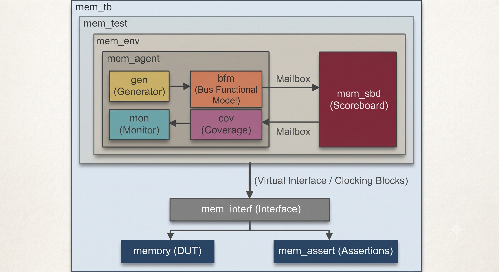

# 🏛️ SystemVerilog Layered Verification Architecture

Below is the complete architectural layout of the Object-Oriented SystemVerilog Testbench designed for the synchronous Memory RTL module:

  

---

## 📑 Architecture Overview & Component Breakdown

The testbench is structured following industry-standard layered verification principles to ensure modularity, high reusability, and automated pass/fail self-checking.

---

### 🔹 1. Transaction Layer (`mem_tx`)
* 📦 **Packet Definition:** Encapsulates memory operations (`READ`, `WRITE`, `IDLE`) into discrete class-based transaction objects.
* 🎲 **Constrained Randomization:** Uses `rand` variables with constraints on addresses (e.g., boundary conditions `0x00`, `0xFF`), data patterns, and burst lengths to trigger corner cases automatically.

---

### 🔹 2. Stimulus Generation & Driving
* ⚙️ **Generator (`mem_gen`):** Instantiates and randomizes `mem_tx` objects based on target test scenarios, pushing packets into a SystemVerilog `mailbox`.
* 🚗 **Driver / BFM (`mem_driver`):** Retrieves transactions from the mailbox and translates pin-level signals cycle-accurately across the clocking blocks (`driver_cb`) of the virtual interface.

---

### 🔹 3. Design Under Test (`DUT`) & Interface
* 🔌 **Virtual Interface (`mem_if`):** Decouples the structural RTL pins (`clk`, `rst_n`, `wr_en`, `rd_en`, `addr`, `wdata`, `rdata`) from class-based verification components, resolving race conditions via dedicated `clocking blocks`.
* 💾 **Memory RTL:** Synchronous dual-port/single-port RAM handling pipelined read/write cycles, synchronous resets, and edge-aligned transactions.

---

### 🔹 4. Monitoring & Self-Checking
* 👁️ **Monitor (`mem_monitor`):** Passively listens to interface buses via `monitor_cb`, samples valid transactions, packetizes them, and broadcasts them downstream.
* ⚖️ **Scoreboard (`mem_scoreboard`):** 
  * Integrates an **Associative Array / Queue-based Reference Model** tracking golden memory contents.
  * Dynamically compares actual DUT output data against predicted reference values and flags mismatches instantly.

---

### 🔹 5. Quality Assurance & Coverage Metrics
* 🛡️ **SystemVerilog Assertions (SVA):** Monitors protocol checks concurrently (e.g., reset assertion timing, write-to-read latency, data bus stability during active operations).
* 📊 **Functional & Code Coverage (`mem_coverage`):** Collects functional coverage metrics using `covergroups` and cross-coverage between operation types, address spaces, and data boundaries.

---

## 🔄 Simulation & Data Flow Pipeline

| Step | Component | Action |
| :--- | :--- | :--- |
| **01** | `mem_gen` | Generates constrained-random transaction packets |
| **02** | `mem_driver` | Drives signals to DUT via virtual interface clocking block |
| **03** | `DUT` | Executes synchronous memory write/read operations |
| **04** | `mem_monitor` | Passively captures bus state and builds output transactions |
| **05** | `mem_scoreboard` | Validates captured output against internal golden reference model |
| **06** | `mem_coverage` | Samples cross-coverage and functional bins for verification closure |
