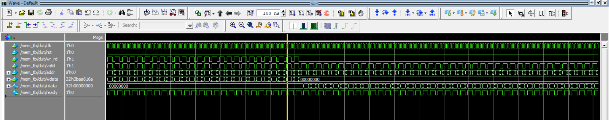
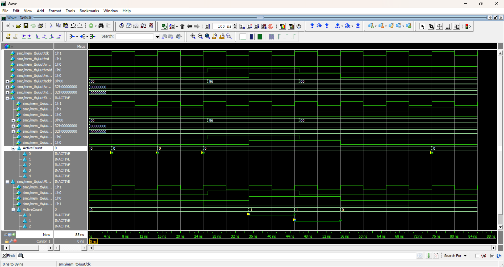

# 📈 Comprehensive Verification Results & Microarchitectural Analysis

This document delivers an in-depth analysis of the simulation data, code/functional coverage metrics, protocol assertions, and execution artifacts generated for the [memory_design_systemverilog_verification](../) project using *Siemens QuestaSim*.

---

## 🎯 Verification Strategy & Sign-Off Criteria

The verification environment validates complete functional correctness, timing closure, and boundary handling for the memory controller RTL:

* **Clock Synchronous Integrity:** Verify zero race conditions and zero setup/hold timing violations across positive-edge triggered operations.
* **100% Structural & Functional Closure:** Complete branch, statement, condition, toggle, and cross-coverage closure.
* **Formal Protocol Invariants:** Implement SystemVerilog Assertions (SVA) to continuously monitor interface protocols, uninitialized state handling, and handshake rules.

---

## 📂 Verification Pillars & Artifact Analysis

### 🔹 1. Code & Functional Coverage Analysis (`results/coverage/`)



**📊 Metric Evaluation**
* **Statement & Block Coverage (100% Target):** Evaluates all operational branches including write latching, synchronous read pipeline stage, active-low reset clearing, and default high-impedance/hold modes.
* **Branch & Condition Coverage (100% Target):** Evaluates all conditional decision paths (`wr_en`, `rd_en`, `rst_n`, and address decode limits).
* **Toggle Coverage:** Ensures full toggle activity ($0 \rightarrow 1$ and $1 \rightarrow 0$) on all individual bitlines across `addr`, `wdata`, and `rdata`, verifying that no data lines are tied off or floating.
* **Functional Coverage & Cross-Bins:** Verified boundary addresses (`0x0000`, `0xFFFF`), sparse random addresses, and `wr_en` $\times$ `rd_en` operational crosses.

---

### 🔹 2. Protocol Assertions Verification (`results/waveforms/assertions/`)



**🛡️ Protocol Invariants & Assertion Analysis**

* **Unwritten Address Read Check (`assertion_unWritten_read`):**
  * Evaluates system response when a read strobe (`rd_en = 1`) targets an uninitialized or unwritten memory address.
  * Validates that the memory either returns a deterministic default value or asserts an error flag without corrupting internal memory array contents or inducing metastable `X` propagation.
  ```systemverilog
  // SVA: Validate unwritten read handling and data bus stability
  assert property (@(posedge clk) disable iff (!rst_n)
    (rd_en && !written_addresses[addr]) |=> !$isunknown(rdata)
  ) else $error("Assertion Failed: Unwritten memory read produced invalid/X state on rdata!");
