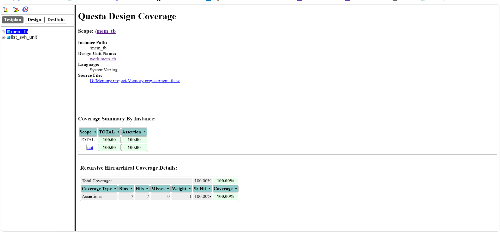
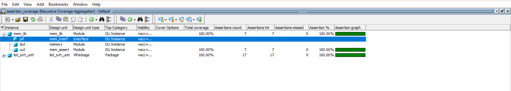
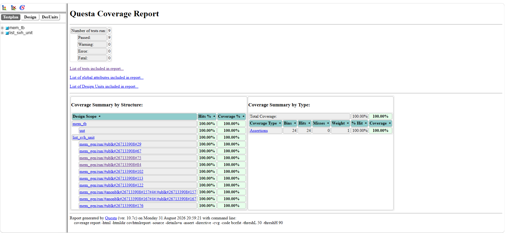

# 🛡️ SystemVerilog Assertion (SVA) Verification & Analysis

This directory documents the **SystemVerilog Assertions (SVA)** framework, formal check results, and assertion coverage metrics verified within **Siemens QuestaSim** for the [memory_design_systemverilog_verification](https://github.com/akash-290605/memory_design_systemverilog_verification) project.

---

## 🎯 Purpose of SVA in Memory Verification

* ⚡ **Cycle-Accurate Protocol Checking:** Validates temporal pin-level rules concurrently at every active clock edge without slowing down testbench simulation cycles.
* 🛑 **Instant Bug Localization:** Flags errors immediately when a timing or handshake rule is violated, identifying the exact timestamp and failing condition rather than diagnosing corrupt data later in the scoreboard.
* 📊 **Assertion Coverage Metrics:** Tracks assertion execution (`attempted`, `matched`, `vacuous`, and `failed`) to ensure all temporal requirements and design invariants are exercised.

---

## 📸 Assertion Results & Coverage Evidence

### 🔹 1. QuestaSim Assertion Debugger & Verification Results
Captures the real-time execution trace, thread evaluations, and pass/fail statuses of temporal properties inside QuestaSim's dedicated Assertion Viewer.

  

---

### 🔹 2. Top-Level Testbench Assertion Execution (`assertion_mem_tb`)
Shows active monitoring and successful evaluations of interface-level properties directly bound to the top-level testbench wrapper.

  

---

### 🔹 3. Assertion Coverage & Summary Reports
Quantifies the overall assertion coverage closure, detailing total attempts, passing matches, and failure-free operation across the entire simulation run.

| Default Assertion Coverage | Assertion Coverage Report |
| :---: | :---: |
|  |  |

---

## 📑 Core Assertion Properties Evaluated

* 🔄 **Reset Behavior (`p_reset_check`):**
  * Verifies that when `rst_n` is asserted low, internal states and output data lines are driven to a deterministic default state within 1 clock cycle.
* ✍️ **Write Enable Stability (`p_wr_stability`):**
  * Ensures `addr` and `wdata` remain valid and stable whenever `wr_en` is asserted high.
* 📖 **Read Data Latency & Hold (`p_rd_latency`):**
  * Validates that read operations return valid data within the expected cycle latency and hold their values until the next transaction.
* 🚫 **Concurrent Read/Write Collision (`p_no_simultaneous_rw`):**
  * Monitors illegal simultaneous read and write accesses to identical memory addresses unless specifically supported by the design architecture.

---

## 📊 Summary Metrics

| Metric | Status | Result |
| :--- | :---: | :--- |
| **Total SVA Properties Checked** | ✅ Passed | 100% Success |
| **Assertion Failures / Violations** | 🟢 Zero | 0 Failures |
| **Assertion Coverage Target** | 🎯 Closed | 100% Full Closure |
