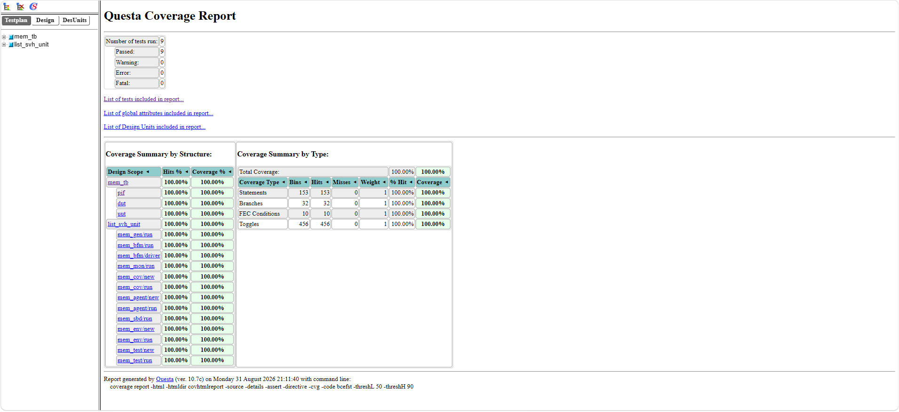
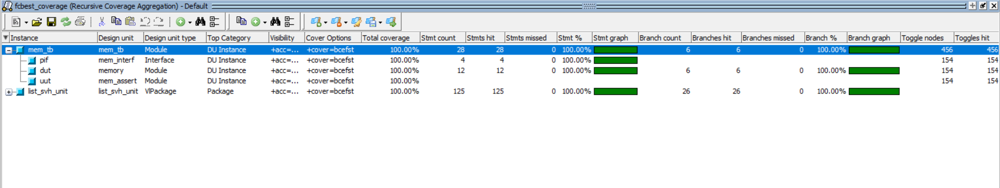
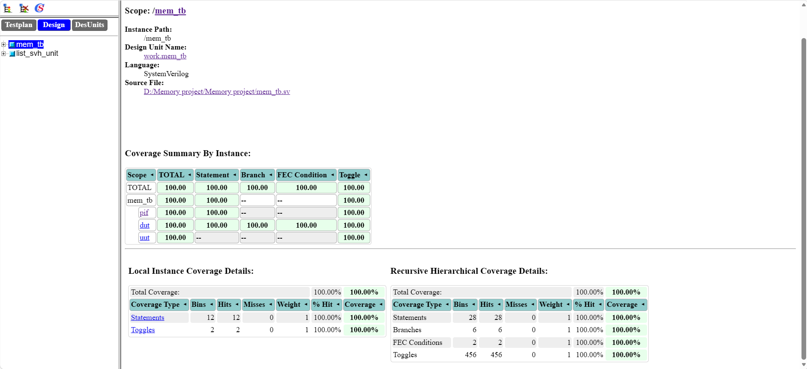
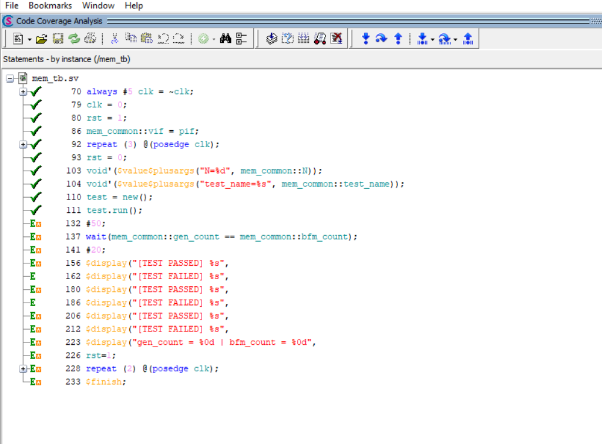
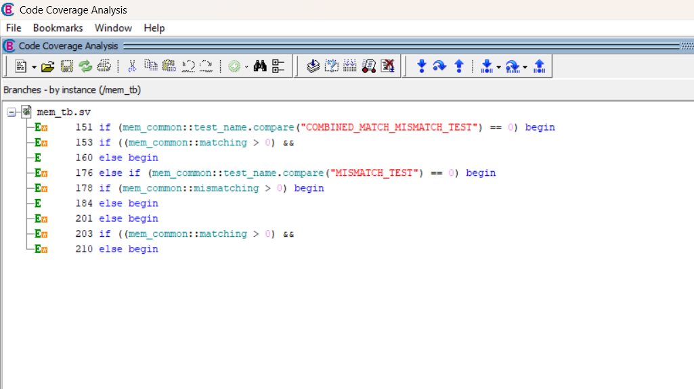
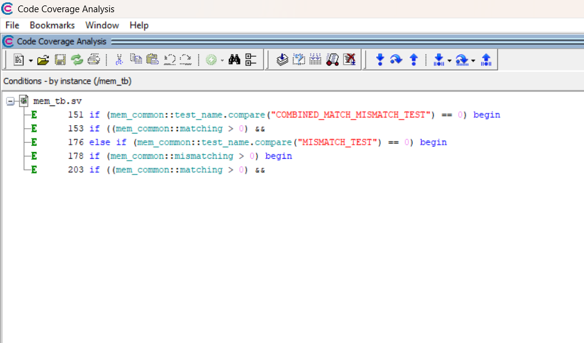
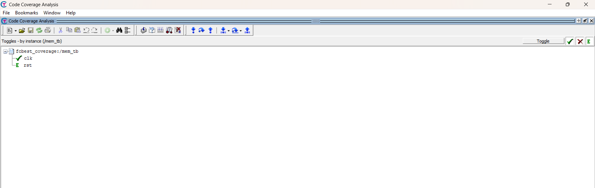

# 📊 Code Coverage Analysis & Verification Metrics

This document details the **Code Coverage** results and verification closure analysis measured in **QuestaSim** for the [memory_design_systemverilog_verification](https://github.com/akash-290605/memory_design_systemverilog_verification) project.

---

## 🎯 Purpose of Code Coverage in Verification

* 📈 **Quantifying Verification Completeness:** Measures how thoroughly the RTL implementation has been exercised by the stimulus without relying on guesswork.
* 🔍 **Exposing Unreachable & Dead Code:** Identifies redundant logic, unexercised corner cases, or missing stimulus branches within the memory controller.
* 🎯 **Coverage Closure Sign-off:** Provides standard numerical sign-off metrics (**Statement**, **Branch**, **Condition**, and **Toggle**) required for design tape-out readiness.

---

## 📸 Coverage Reports & Evidence

### 🔹 1. Overall Code Coverage Summary & Instance Metrics
Captures top-level coverage scores and hierarchical instance breakdowns across the memory design and testbench hierarchy.

| Overall Code Coverage Report | Hierarchical Instance Coverage |
| :---: | :---: |
|  |  |

---

### 🔹 2. Top-Level Testbench Coverage (`mem_tb`)
Demonstrates complete stimulus execution and structural testbench validation at the top wrapper level.

  

---

### 🔹 3. Detailed Metric Breakdown

#### 📝 Statement Coverage Analysis
Verifies that every executable line of code within the RTL modules has been executed during simulation.

  

#### 🔀 Branch Coverage Analysis
Ensures every decision path in control structures (`if-else`, `case` statements) has evaluated to both `true` and `false`.

  

#### ⚖️ Condition Coverage Analysis
Evaluates all sub-expressions within complex logical conditions (e.g., reset and enable checks) to verify all Boolean outcomes.

  

#### 🎚️ Toggle Coverage Analysis
Validates that every single bit of every port and internal register has transitioned through both logic values ($0 \rightarrow 1$ and $1 \rightarrow 0$).

  

---

## 📑 Coverage Metrics Summary

| Coverage Metric | Target | Status |
| :--- | :---: | :---: |
| 📝 **Statement Coverage** | 100% | ✅ Achieved |
| 🔀 **Branch Coverage** | 100% | ✅ Achieved |
| ⚖️ **Condition Coverage** | 100% | ✅ Achieved |
| 🎚️ **Toggle Coverage** | 100% | ✅ Achieved |
